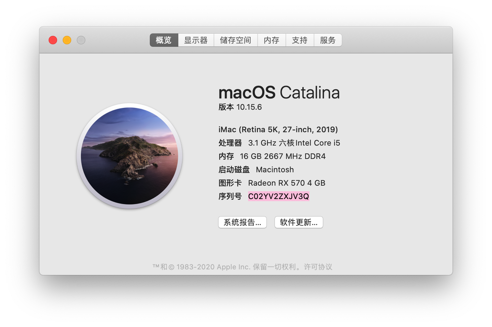
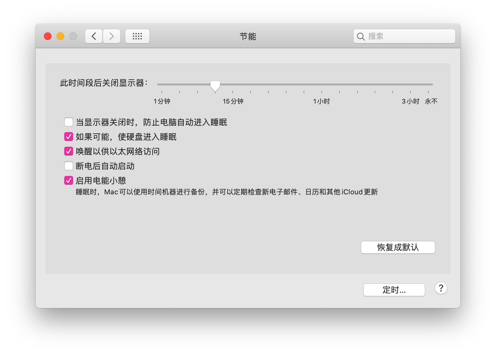
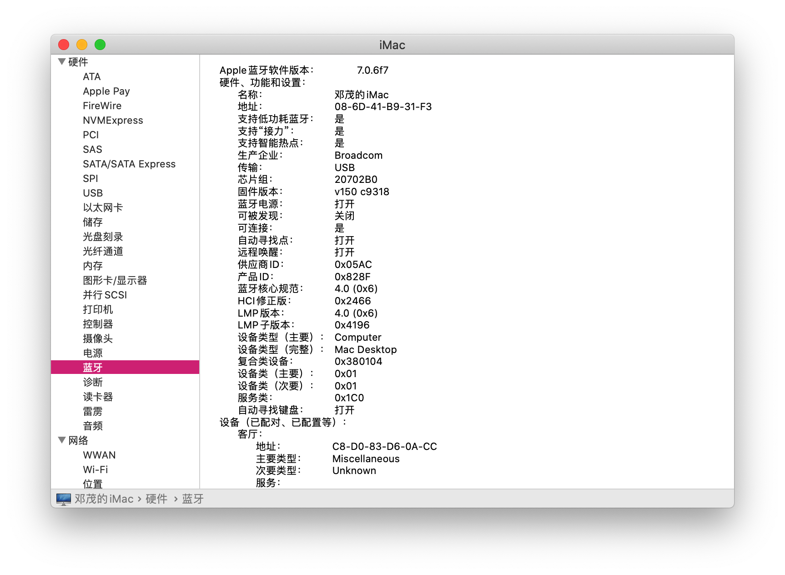
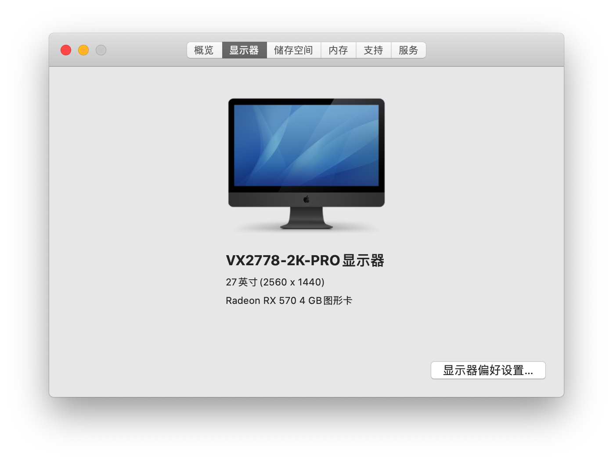
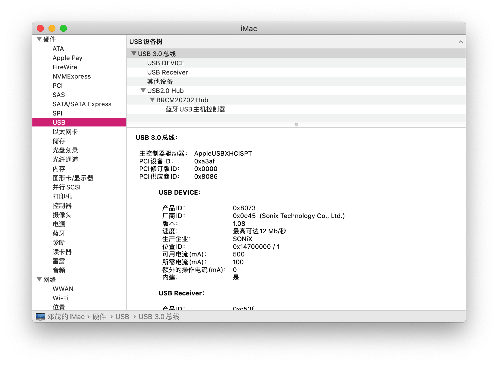

# i5-10500-AsRock-B460m-Pro4-Hackintosh
Hackintosh

*可以支持Big sur的安装，但是需要仿冒CPUID，否则会卡EB*

*The EFI can install Big sur,but it needs fake intel CPUID,otherwise it will stuck on EB*
```
<key>Emulate</key>
<dict>
    <key>Cpuid1Data</key>
    <data>6gYJAAAAAAAAAAAAAAAAAA==</data>
    <key>Cpuid1Mask</key>
    <data>/////wAAAAAAAAAAAAAAAA==</data>
</dict>
```
# Info PC
* matherboard: AsRock B460m Pro4
* CPU: intel Core i5-10500
* GPU: AMD Radeon RX 570
* Network card: BCM94360CS2
# works
- Sleep
- Wake
- Audio
- Ethernet
- Bluetooth
- DisplayPort + HDMI simultaneously
- All USB ports (Full 3.0 + 2.0 + type C)

# Result






# Note

The file config.plist. Please change MLB, SystemSerialNumber, SystemUUID , ROM into your code

```
<dict>
    <key>AdviseWindows</key>
    <false/>
    <key>MLB</key>
    <string>xxxxxxxxxxxxxxx</string>
    <key>ROM</key>
    <data>xxxxxxxx</data>
    <key>SpoofVendor</key>
    <true/>
    <key>SystemProductName</key>
    <string>iMac19,1</string>
    <key>SystemSerialNumber</key>
    <string>xxxxxxxxxxx</string>
    <key>SystemUUID</key>
    <string>xxxxxxxx-xxxxx-xxxxx-xxxx-xxxxxxxx</string>
</dict>
```
